Данное руководство содержит инструкции по развёртыванию основного приложения OpenMes, запуску скрипта имитации работы и использованию утилиты для визуального создания технологических шагов интеграции с Open-RMF.
1. Развёртывание и запуск OpenMes
Вариант А. Развёртывание через Docker

Полная и актуальная инструкция по контейнеризированному запуску приложения доступна в официальном репозитории:
GitHub OpenMes: https://github.com/Mes-Open/OpenMes
Вариант Б. Локальное развёртывание (Apache2 / CLI)

Для ручного запуска backend- и frontend-частей приложения выполните следующие шаги:

    Клонирование репозитория: Скопируйте исходный код проекта из GitHub в рабочую директорию на вашем сервере/ПК.

    Инициализация проекта: Откройте терминал в папке openmes/backend и выполните скрипт автоустановки:
    Bash

    ./install.bash

    Настройка окружения: В корневой папке бэкенда откройте файл .env и замените шаблонные конфигурационные данные (подключение к БД, ключи и др.) на ваши реальные параметры.

    Запуск серверов:

        В первом окне терминала запустите сборщик фронтенда:
        Bash

        npm run dev

        Во втором окне терминала (в той же директории) запустите встроенный PHP-сервер:
        Bash

        php artisan serve

    Проверка работы: Перейдите в браузере по адресу: http://127.0.0.1:8000.
2. Имитация работы интеграции (Скрипт CompleteButch.py)

Скрипт предназначен для симуляции выполнения производственных процессов вне контура Open-RMF.

    Выбор партии: Откройте файл CompleteButch.py и присвойте переменной num идентификатор (id) целевой партии (batch), которую необходимо выполнить.
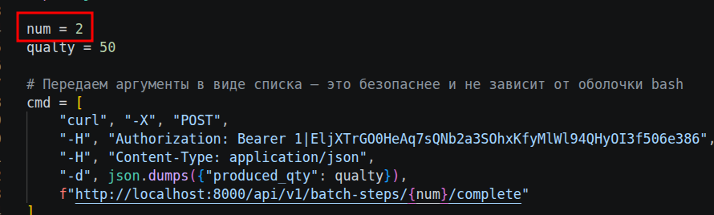
    Авторизация: В теле запроса добавьте заголовок авторизации, указав ваш персональный токен доступа (токен генерируется в настройках профиля OpenMes):
    Plaintext

    "-H", "Authorization: Bearer <ВАШ_ТОКЕН>"
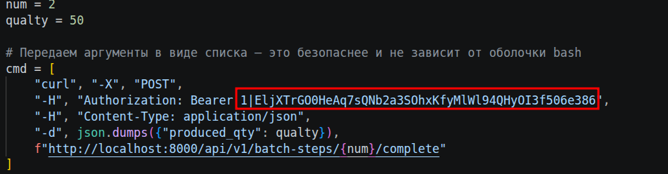

    Запуск: Выполните скрипт в вашей Python-среде:
    Bash

    python CompleteButch.py

3. Подготовка утилиты создания шагов для Open-RMF

Перед запуском визуального интерфейса необходимо убедиться в наличии всех зависимостей и корректности сетевых настроек.
Требования к окружению

В рабочей директории программы в обязательном порядке должны присутствовать следующие файлы:

    visual.py — основное приложение.

    addStep.py, GetPoints.py, GetProducts.py — модули интеграции.

Порядок настройки:

    Активация среды: Установите и активируйте виртуальное окружение Python (папка .venv / .vite) в директории программы.

    Настройка базы данных: В файлах addStep.py и GetProducts.py укажите актуальные доступы и параметры подключения к базе данных.

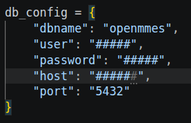

    Настройка сети Open-RMF: В файле GetPoints.py замените все шаблонные IP-адреса на реальный IP-адрес сервера, на котором развёрнута система Open-RMF.

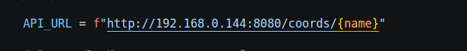

    Запуск: Запустите графический интерфейс командой:
    Bash

    python visual.py

4. Инструкция по созданию шагов через visual.py

Используйте этот алгоритм для генерации шагов, предназначенных для обработки робототехнической системой Open-RMF:

    Выбор карты: В верхнем выпадающем списке выберите необходимую карту.
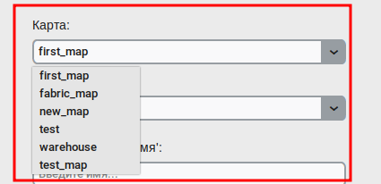

        Примечание: Если список пуст, это сигнализирует об отсутствии связи с сервером Open-RMF. Проверьте IP-адреса в GetPoints.py.
        

    Выбор номенклатуры: Выберите товар, к которому привязывается создаваемый технологический шаг.
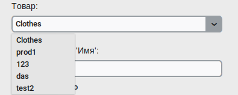

    Именование: Введите текстовое название шага в соответствующее поле.
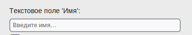

    Маршрутизация: В выпадающих списках выберите точку отправления (откуда забирать материал) и точку назначения (куда его транспортировать).
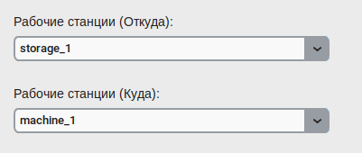
    Сохранение: Нажмите кнопку «Подтвердить» для записи шага в систему.

    Важно: Если вам необходимо создать стандартный производственный шаг, не связанный с отправкой команд или инструкций в Open-RMF, добавляйте такой шаг напрямую через стандартный интерфейс OpenMes.
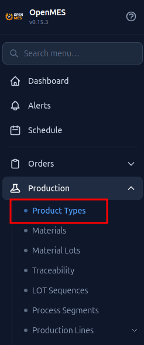
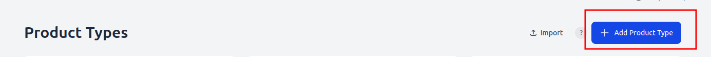
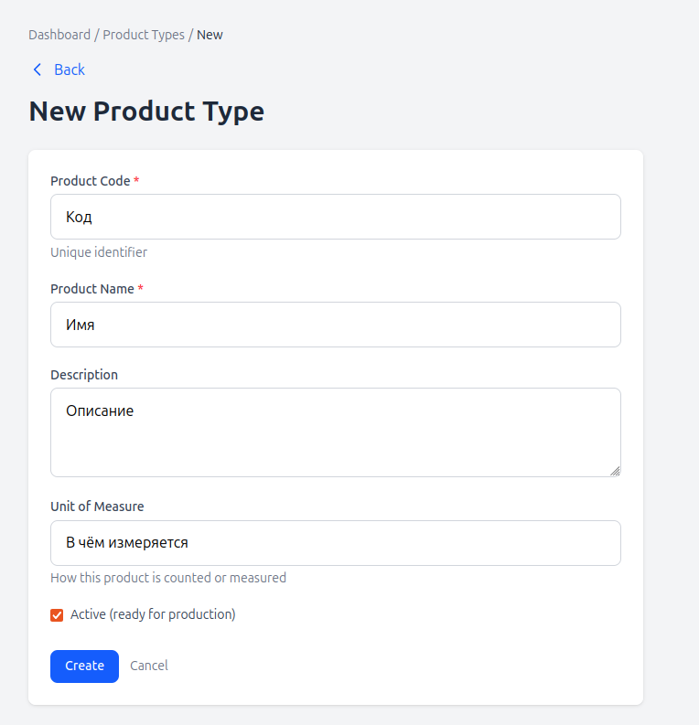

    